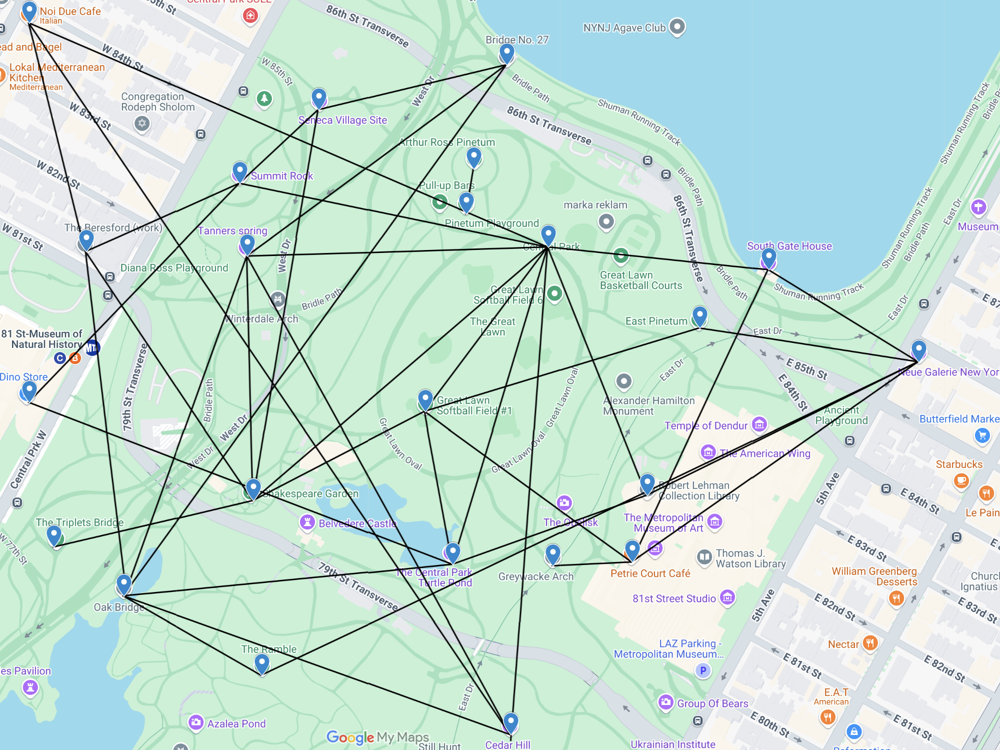

# Wheelchair Path Finder

The Wheelchair Path Finder application allows users to find optimal routes in a mapped environment using the **A\* algorithm**, with consideration for accessibility constraints such as slopes, kerb ramps, and sidewalk widths.

---

## Features

- **Map creation**: Convert from `.kmz` (Google Maps file) to adjacency matrix.
- **A\* pathfinding algorithm**:
  - **Standard search**: Finds the shortest path.
  - **Accessibility-aware search**: Finds the best path for wheelchair users.
- **Benchmarking**: For performance evaluation and comparison.
- **Interactive CLI:**
  - Run pathfinding
  - Run benchmarks
  - View map

---

## Setup Instructions

### 1. Install Dependencies

```bash
pip install -r requirements.txt
```

### 2. Run the Application

```bash
python main.py
```

---

## Example Usage

### Path Finder

1. Select the path finder option. All the available locations will be shown.
2. Enter the start location.
3. Enter the goal location.
4. Choose whether to consider wheelchair accessibility.
5. The program will output the following:

- Optimal path
- Distance
- Estimated travel time
- Internal A\* search metrics:
  - Accessibility cost
  - Nodes created
  - Nodes explored
  - Execution time (ms)

### Benchmarking

1. Select the benchmarking option.
2. The program automatically runs the A\* algorithm (with and without considering accessibility) on 20 test cases. Each test case is run 5 times and the results are averaged.
3. After the benchmarking is complete, the following metrics are displayed:

- Real-world distance (in meters)
- Accessibility-adjusted cost
- Number of nodes created and explored
- Execution time (in milliseconds)

---

# Map

The following map of **Central Park, New York City** was drawn using Google Maps, with `23` nodes and `40` path segments.



---

## Accessibility Considerations

### Accessibility Feature Generation

Accessibility attributes for each edge in the map are randomly initialized to reasonable values as follows:

- **Slope**: Each edge has a 50% chance of being flat (0°). Otherwise, a random slope angle between 0° and 45° is assigned.
  ```python
  slope = 0 if random.random() < 0.5 else round(random.uniform(0, 45), 1)
  ```
- **Kerb ramps**: Kerb ramps are either present (1) or absent (0), with equal probability.
  ```python
  kerb = random.randint(0, 1)
  ```
- **Sidewalk width**: Width is randomly assigned between 0.9m and 3.0m.
  ```python
  width = round(random.uniform(0.9, 3.0), 1)
  ```

### Cost Adjustment Formula

If the user enables accessibility-aware pathfinding, the algorithm adjusts the traversal cost between nodes based on several accessibility-related constraints. These factors are applied in addition to the base Euclidean distance.

```python
slope_factor = 1 + (slope / 45 * 4)          # 0° = 1x, 45° = 5x
kerb_factor = 2 if kerb == 0 else 1          # Missing kerb ramps double the cost
width_factor = 1 + (max(0, (1.5 - width)) / (1.5 - 0.9))  # Narrow sidewalks penalized

cost_multiplier = slope_factor * kerb_factor * width_factor
adjusted_cost = distance * cost_multiplier
```

This formula ensures that steeper slopes, missing kerb ramps, and narrow sidewalks proportionally increase the traversal cost, guiding the A\* algorithm toward more accessible paths.

---

## Directory Structure

```
.
├── main.py                                     # Entry point with CLI menu
├── map_creation/                               # Tools to extract and process KMZ maps
│   ├── map_to_matrix.py                        # Extract KMZ to adjacency matrix
│   ├── add_accessibility.py                    # Randomly generate accessibility features
│   └── initialize_map.py                       # Load full map with accessibility data
├── path_finding/                               # Logic for pathfinding algorithms and benchmarks
│   ├── a_star.py                               # A* algorithm implementation
│   ├── path_finder.py                          # Abstract base class and helper logic
│   ├── custom_types.py                         # Definitions for custom types
│   └── benchmark.py                            # Run automated benchmarks
├── map/                                        # Map assets
│   ├── adjacency_matrix.csv                    # Base adjacency matrix of the map
│   ├── adjacency_matrix_kerb_ramps.csv         # Matrix indicating presence/absence of kerb ramps
│   ├── adjacency_matrix_node_features.csv      # Features available at each node (e.g. amenities)
│   ├── adjacency_matrix_sidewalk_width.csv     # Sidewalk width information for each edge
│   ├── adjacency_matrix_slope.csv              # Slope data between connected nodes
│   ├── node_coordinates.json                   # Geographical coordinates of each node
│   ├── map.kmz                                 # Input KMZ map file used for path extraction
│   └── map.png                                 # Optional image preview of the map for CLI display
├── requirements.txt                            # Python dependencies
└── README.md                                   # Application documentation
```

---

## Acknowledgments

The following open-source Python libraries were used in this project:

- `colorama` – Terminal text coloring for CLI enhancement
- `geopy` – Geodesic distance computation for node coordinates
- `numpy` – Efficient numerical operations and matrix handling
- `pandas` – CSV handling, data manipulation, and matrix storage
- `tabulate` – Clean tabular formatting for terminal output

These libraries are listed in `requirements.txt`.
